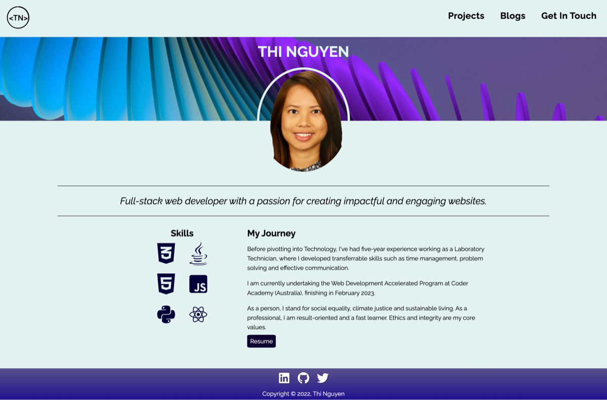
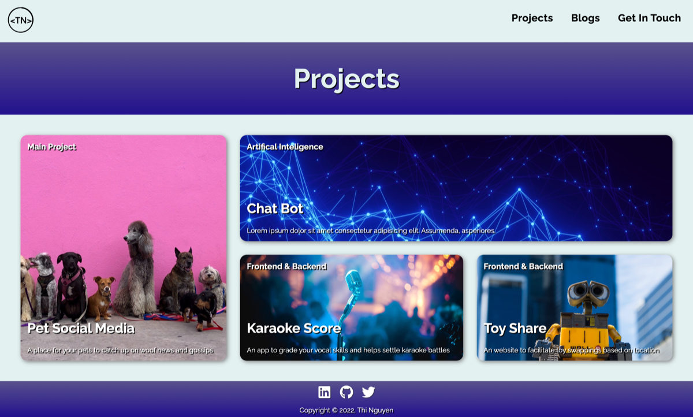
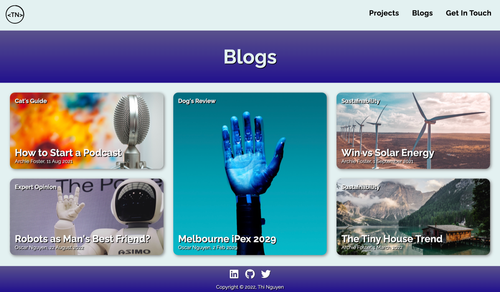
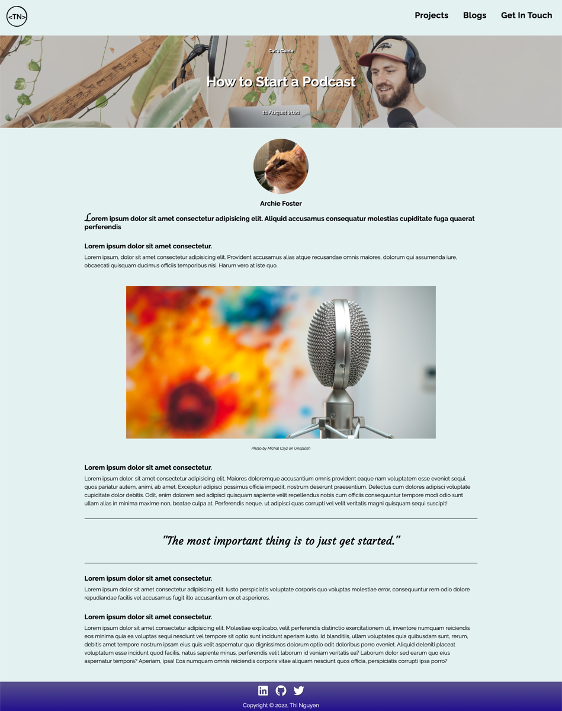
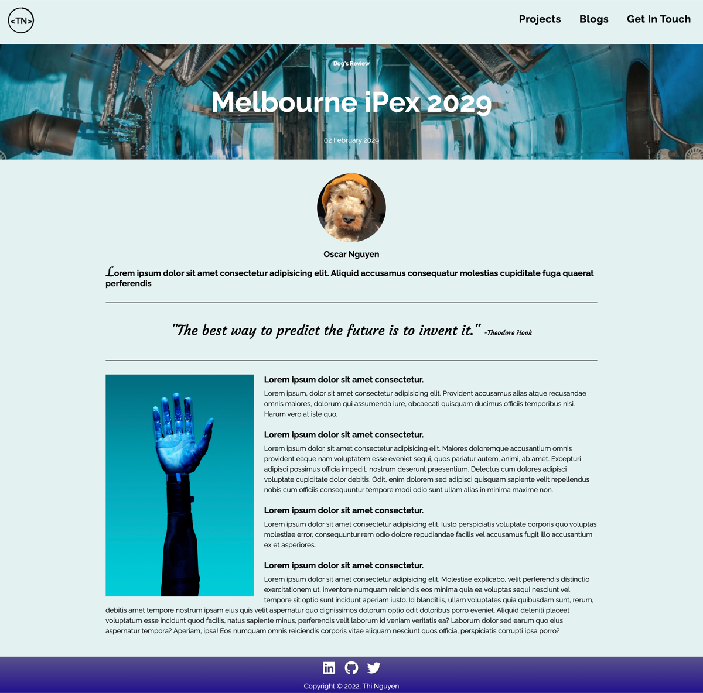
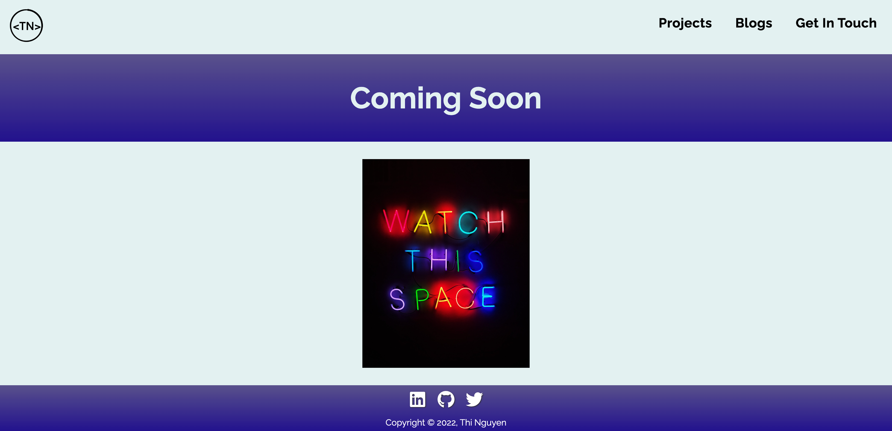

# Thi Nguyen's T1A2

[Link to website](https://thi-nguyen-portfolio.netlify.app)  
[Link to Github repository](https://github.com/Thi-Tracey-Nguyen/T1A2)  

## Purpose
This porfolio was created to practice my knowledge of HTML and CSS. It will be updated later as I learn new things to showcase my skills and projects. 

## Functionality
This site is responsive across multiple device widths such as smart phones, tablets and desktops. Color pallet consists of navy, purple and pink to create a professional, fun and futeristic appearance. There are 4 pages:  
1. Index/Home: is a landing page and contains a photo and infomation of the creator (me) such as skills, experience and a link to a Resume on Google Drive.  
2. Projects: contains of 4 madeup projects, arranged using Grid in CSS. Each project "card" provided information about the project such as category, name, and a blurb.  
3. Blogs: shows 5 blog "cards" styled as boxes. They were arranged using Grid in CSS. Each card had information about the blog such as category, title, author and date published.
4. Get in touch: has linked to my social accounts (GitHub, LinkedIn, and Twitter)

My favourite feature of the page is the use of Grid, it allows each "card" to be highly responsive to changes in the viewports.  

## Sitemap

Sitemap made using Balsamiq Cloud

## Screenshots
##### Home page has information about skills, experience and link to resume.

##### Project page with 4 made-up projects. Each project card is linked to "Coming Soon" page.

##### Blogs page with 5 blogs. Each card has information such as category, title, author and date published. Blog card are linked to respective pages.

##### Get In Touch page with links to Twitter, GitHub and LinkedIn. Icons are linked to respective pages.

##### Blog post format #1. 

##### Blog post format #2. 

##### Coming Soon page to link projects.

## Target Audience
This website is made for potential employers and recruiters in the IT field.  

## Tech Stack
HTML5, CSS3, Netlify (deployment) and GitHub (version control).  
